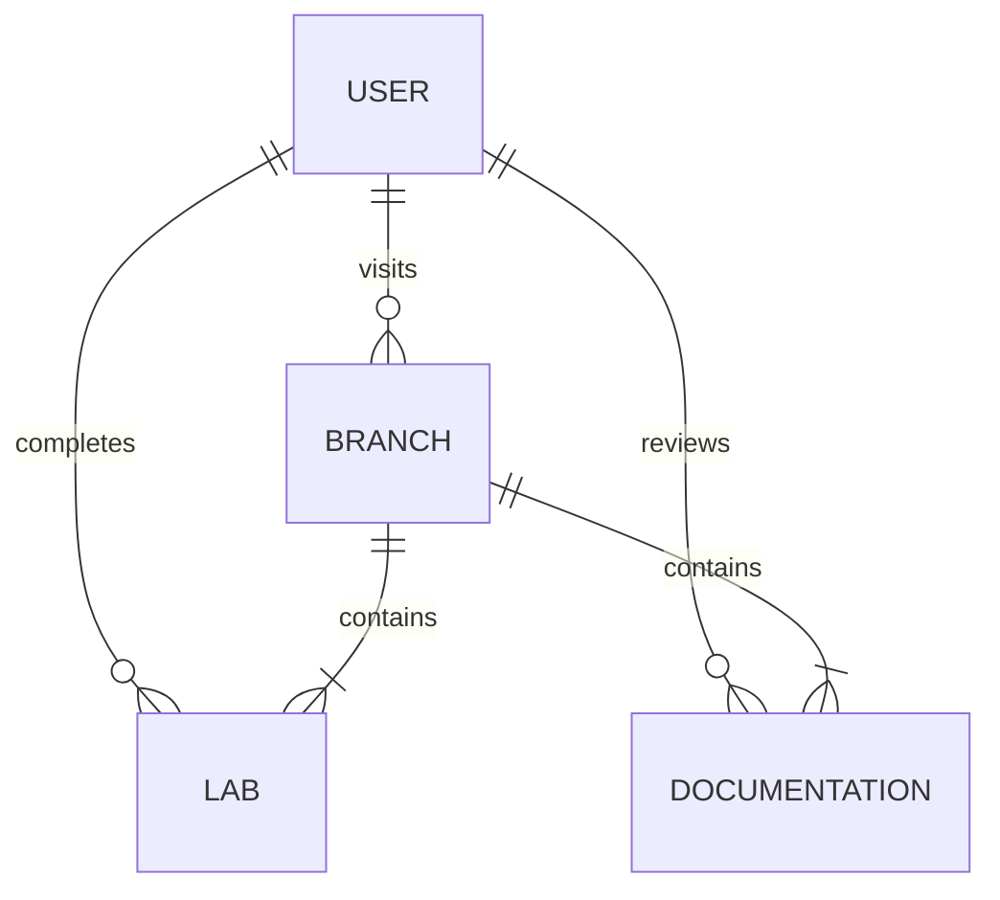

# API Lab: Introduction to Application Programming Interfaces

<<<<<<< HEAD
## Project Overview

The following project utilizes an **Agile** approach to software testing and development. This project will serve those without technical expertise to better understand the tools and processes necessary for software quality assurance. The project aims to demonstrate how to properly operate platforms such as **Selenium** and **Postman**. The project will also implement behavior-driven (**BDD**) software development frameworks like **Behave**. Expect to find information and resources on web application testing. Labs are designed and centered around the following:

 **BDD**: Behavior-Driven Development
 **TDD**: Test-Driven Development
 **API**: Application Programming Interface
 **CI/CD**: Continuous Integration and Development

### Team 1 Members:
- Kristina Markina - Lead 
- Chase Davis - BDD
- Shawn Palmer - Selenium & DevOps
- Deandre Scott - BDD
- Marvelle Carter - Tester
- Noah Garner - TDD
- Dawson Pridgen - API

## Features

* Interactive labs for learning software tools and techniques.
* Comprehensive documentation following **Agile** principles.
* Resources on relevant software testing frameworks and practices.

## Visual aid diagram:

## User instructions

1. Reference lab documentation/information.
2. Download the necessary files, in accordance to their version/dependencies.
3. Analyze and review lab contents.
4. Solve all major tasks using the correlating software or framework.

## Labs
| Lab | Topic     |
| --- | --------  |
| 1   | Selenium  |
| 2   | BDD       |
| 3   | API       |
| 4   | TDD       |
| 5   | DevOps    |

## Expectations
Identify errors, inconsistencies, or other noteworthy improvements and document them.
Communicate openly. Notify others of resolved issues and provide feedback.
Monitor objectives, goals, and overall progress on **GitHub**.

## Known Issues
(Here is where to place issues as they update and appear.)
=======
## Lab Overview
Welcome to the API Lab! In this lab, you will learn how to use Postman to simplify the API process of building applications for existing software systems. By the end of this lab, you will understand how to use APIs to leverage existing code and seamlessly integrate across applications. 
>>>>>>> origin/API-Tests-Lab

## Reference Materials
- **Python**:
  * [Python Documentation](https://docs.python.org/3/)
- **API**:
  * [API with Python](https://www.dataquest.io/blog/python-api-tutorial/)
- **Postman**:
  * [Postman Learning Center](https://learning.postman.com/)
