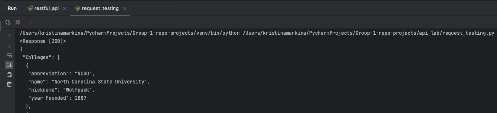
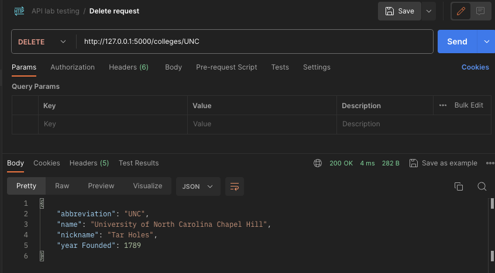

# API Lab: Introduction to Application Programming Interfaces

## Lab Overview
Welcome to the API Lab! In this lab, you will learn how to use Postman to simplify the API process of building applications for existing software systems. By the end of this lab, you will understand how to use APIs to leverage existing code and seamlessly integrate across applications. 

## Reference Materials
- **Python**:
  * [Python Documentation](https://docs.python.org/3/)
- **API**:
  * [API with Python](https://www.dataquest.io/blog/python-api-tutorial/)
- **Postman**:
  * [Postman Learning Center](https://learning.postman.com/)

## Instructions

1. Clone repo to your local machine and install interpreter.

2. Install **flask** and **requests**:
- *pip install flask*
- *pip install requests*

3. Download and install [Postman](https://www.postman.com/)

## Test API using Requests library
1. Run file "restful_api.py". You should get output similar to this:


2. To verify that the program is running correctly go to [http://127.0.0.1:5000/colleges](http://127.0.0.1:5000/colleges). Your output should look like this:


3. The first method we will test is POST. This allows us to insert new data into our database. In the ‘request_testing.py’ file insert the following code:

```python
# imports request and json libraries
import requests
import json

# determines where the POST request will be sent
ENDPOINT = "http://127.0.0.1:5000/colleges"

# the data that will be sent to the API
data_to_post = {'name': 'North Carolina Central University', 'abbreviation': 'NCCU', 'year_founded': 1910,
                'nickname': 'Eagles'}

# sends the POST request and prints the response from the server
response = requests.post(ENDPOINT, json=data_to_post)
print(response)

# prints the json data info that was sent back from the server
data = response.json()
print(json.dumps(data, indent=1))
```

4. With the Flask application running, execute the code you typed in the previous step. If everything is working correctly you should receive this response:


The first line is the result of ‘print(response).’ The code ‘200’ tells us that the request was processed correctly. If you received a different code the request was not processed correctly. The second line is the result of ‘print(data).’ This shows us the JSON data that was sent back from the Flask server.

5. Let’s look at our data that should now include the data sent in step 3. To do that we will use a GET request. This retrieves all the data found at a certain endpoint. This is another way of doing what we did in step 2. Except this time it is being done using the requests library. To do this insert the following code into ‘request_testing.py’:

```python
# imports request and json libraries
import requests
import json

# determines where the POST request will be sent
ENDPOINT = "http://127.0.0.1:5000/colleges"

# Sends the GET request to the server and prints the response
response = requests.get(ENDPOINT)
print(response)

# Prints the JSON data sent back from the Flask server
data = response.json()
print(json.dumps(data, indent=1))
```

6. This time when you execute the program you should see the response from the POST request along with our new data from the GET request:


Note that the data sent back now includes the data sent in our POST request! This verifies that not only has the POST request been sent successfully, but that it has been correctly added to the JSON data on our Flask server.

7. Next we will test the PUT method on our API. This allows us to update information that is already in our database, instead of adding completely new information with the POST request. Like all respectable people you strongly dislike UNC. So let’s change the ‘nickname’ for UNC in our database to something more appropriate. To do this, insert the code below into your program:

```python
# imports request and json libraries
import requests
import json

# Select a new endpoint to send our PUT request to
ENDPOINT = "http://127.0.0.1:5000/colleges/UNC"

# Input the data we want to send
data_to_put = {"nickname": "Tar Holes"}

# Send PUT request to API
response = requests.put(ENDPOINT, json=data_to_put)

# Print the response from the server
print(response)

# Print the JSON data that we received back from the server
data = response.json()
print(json.dumps(data, indent=1))
```

8. Let’s run our program once again. You should see the output from our previous tests along with output from what we added in step 7. It should look something like this:


As you can see the ‘nickname’ for UNC has been changed from ‘Tar Heels’ to ‘Tar Holes’ which is exactly the result we were looking for!

9. Lastly, we should test the DELETE method on our API. Let’s test it out on our old friend UNC. So, we can pretend that they don’t exist. To do this insert the following code into your program:

```python
# imports request and json libraries
import requests
import json

# Select a new endpoint to send our PUT request to
ENDPOINT = "http://127.0.0.1:5000/colleges/UNC"

# Deletes UNC from the database and prints the server response
response = requests.delete(ENDPOINT)
print(response)

# Sends GET request to server and prints response
ENDPOINT = "http://127.0.0.1:5000/colleges"
response = requests.get(ENDPOINT)

# Prints the JSON data received from the GET request to verify that UNC has successfully been deleted
data = response.json()
print(json.dumps(data, indent=1))
```
10. Let’s run our program one more time. We should see the output from all our previous steps and now step 9. Your output should look something like this:



As you can see the DELETE request worked, and UNC has been banished from our database!

## Test API using Postman

Now that we have tested our API using the Requests library, we can move on to testing our API with Postman. Postman allows you to test your API using a GUI. To get started open Postman. You should be greeted by a screen that looks something like this:


1. Let’s start with a POST request.
In the address bar type http://127.0.0.1:5000/colleges.
Then select ‘POST’ from the list of methods to the left of your http address.
Now select the tab that says ‘Body’ to input what we would like to send in our post request.
In the ‘Body’ tab type:
```json
{
  "name": "North Carolina Central University",
  "abbreviation":"NCCU",
  "year_founded": 1910,
  "nickname": "Eagles"
}
```

Above the data you just typed, make sure to select ‘raw’ and ‘JSON’ so that our data is sent correctly. This should be done for all subsequent steps where JSON data is being sent to the API. Now that this is done press the ‘Send’ button in the upper right corner. Your screen should look like this:


2. Next, we will use Postman to submit a PUT request to the API. Press the ‘New’ button in the upper left corner to make a new request. In the address bar type http://127.0.0.1:5000/colleges/UNC. Then to the left select ‘PUT’ from the dropdown list of methods. Now select the ‘Body’ tab and type the following:

```json
{"nickname": "Tar Holes"}
```

Click the ‘Send’ button to send your request. Your screen should look like this:


In the data you received back you should see that ‘nickname’ has successfully been changed.

3. Now we will test the DELETE method.
Press the ‘New’ button in the upper left corner to make a new request.
Type http://127.0.0.1:5000/colleges/UNC into the address bar and select the ‘DELETE’ method from the dropdown list.
That is all that we need to do for this method, so click the ‘Send’ button, and you should see a screen like this one:



The data that has been returned indicates what has been deleted.

4. Finally let’s test the GET method using Postman.
Press the ‘New’ button in the upper left corner to make a new request.
In the address bar type http://127.0.0.1:5000/colleges.
Select ‘GET’ from the dropdown list and press the ‘Send’ button.
Your screen should look like this:


The data you received back should include every school in our database except for the one we just deleted, UNC.