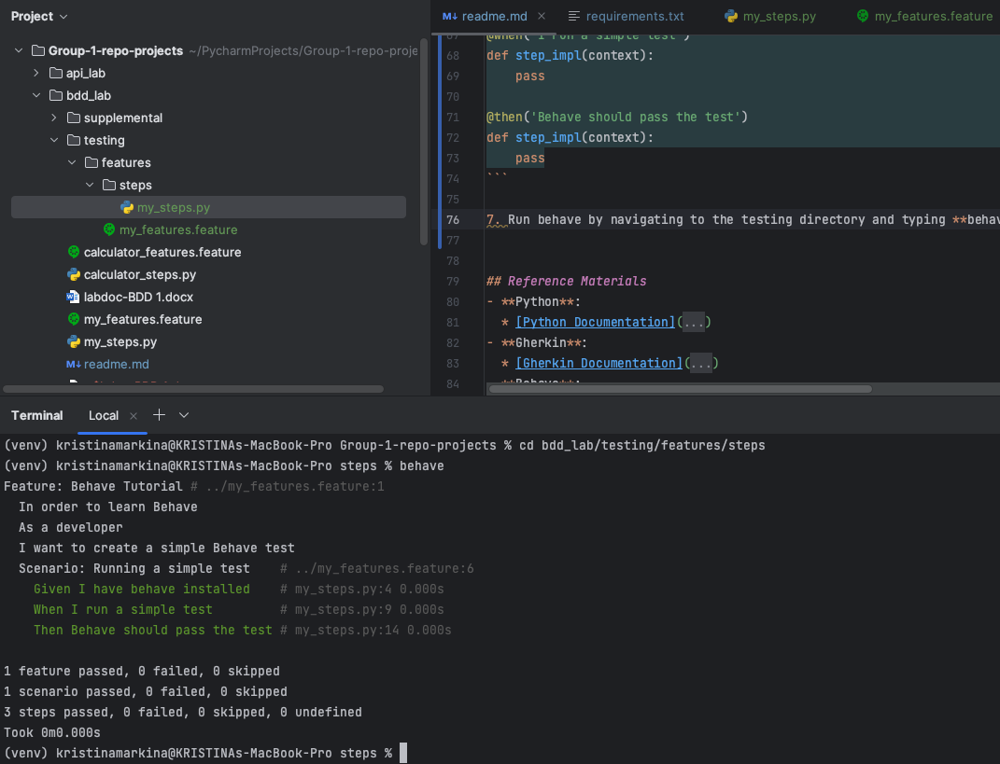

# BDD Lab: Introduction to Behavior-driven Development

## Lab Overview

Behavior-driven development (BDD) is an essential aspect of meeting business requirements.
It ensures that the behaviors of a system are defined clearly before being built.
In this lab, you will explore Behave, a popular tool for automating browser interactions.
You will work with the Python framework to learn how BDD facilitates collaboration among developers, quality assurance teams, and business stakeholders.
Behave is a way to test code using the Gherkin syntax, a plain-text, non-technical, open-source programming language designed to be easily learnable.
Non-programmers can fluently understand Gherkin, making it more accessible.
The framework promotes clear communication of requirements, making it a powerful tool for creating maintainable, easy-to-understand tests in development environments. 

## Lab Objectives

* Gain proficiency in using Behave for web automation and testing.
* Learn to write in the Gherkin language to communicate.
* Understand the basic features and steps involved in working with the Behave framework.
* Develop different behavioral features and scenarios to run tests on.
* Solidify your understanding of the BDD framework using Python.

## Lab Prerequisites

* Basic knowledge of Python programming.
* Understanding of how to install Python libraries using pip.
* Installation of the Behave library (pip install behave).
* Familiarity with the basics of file management.


## Instructions
This lab is here to provide you with hands-on experience using both Behave and the Gherkin Syntax by BDD's best practices.
You will be able to understand the basics of BDD and Behave while expanding your knowledge of the programming language Python.
By the end of this lab, you will have set up a beginner-friendly Behave project using Gherkin syntax.
At the end, you will execute a simple BDD test.

1. Set up a virtual environment (recommended) for your testing environment.
2. Open your code editor (examples are Visual Code Studio) and make a new project directory.
3. Install Gherkin and Behave
- *pip install gherkin-official*
- *pip install behave*
4. Navigate to `bdd_lab` folder, create `features` folder, create `my_features.feature` file inside features folder.
5. Paste the following code inside `my_features.feature` file:
```gherkin
Feature: Behave Tutorial
  In order to learn Behave
  As a developer
  I want to create a simple Behave test

  Scenario: Running a simple test
    Given I have behave installed
    When I run a simple test
    Then Behave should pass the test
```

6. Once inside the features directory, create a folder called 'steps.'
Now, from inside the steps directory, create a Python file named my_steps.py.
Fill the inside of my_steps.py with the following code:

```python
from behave import given, when, then

@given('I have behave installed')
def step_impl(context):
    pass

@when('I run a simple test')
def step_impl(context):
    pass

@then('Behave should pass the test')
def step_impl(context):
    pass
```

7. Run behave by navigating to the testing directory and typing **behave** in your IDE's terminal.
Observe the output in the terminal.
You should see that Behave discovers and executes your scenario successfully.


## Lab challenge

To solidify your understanding of Behave and Gherkin, imagine you are developing a basic web page and need to clearly define the behaviors/features required for entering login credentials and button presses.
You can use calculator_steps.py and calculator_features.feature to reimagine various scenarios, such as if the user enters valid credentials, forgets their password, or enters invalid credentials.
Follow the outlined approach (Given, When, Then, And).
Try altering the calculator example included in this lab to describe the basic behaviors of any object, application, or program.

## Reference Materials
- **Python**:
  * [Python Documentation](https://docs.python.org/3/)
- **Gherkin**:
  * [Gherkin Documentation](https://cucumber.io/docs/gherkin/)
- **Behave**:
  * [Behave Documentation](https://behave.readthedocs.io/en/latest/)
