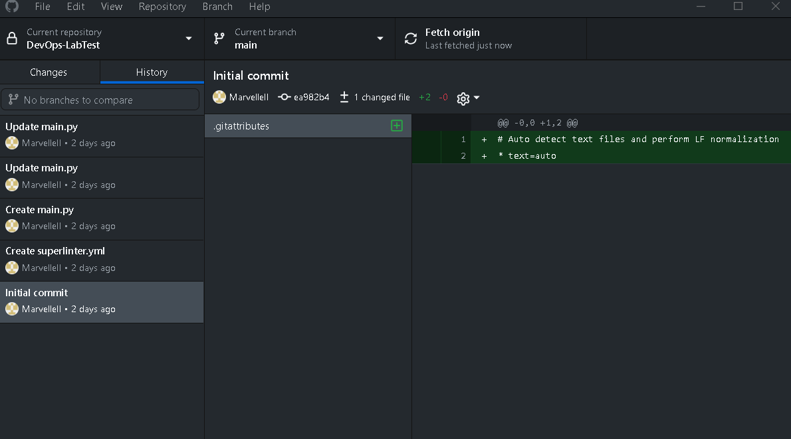
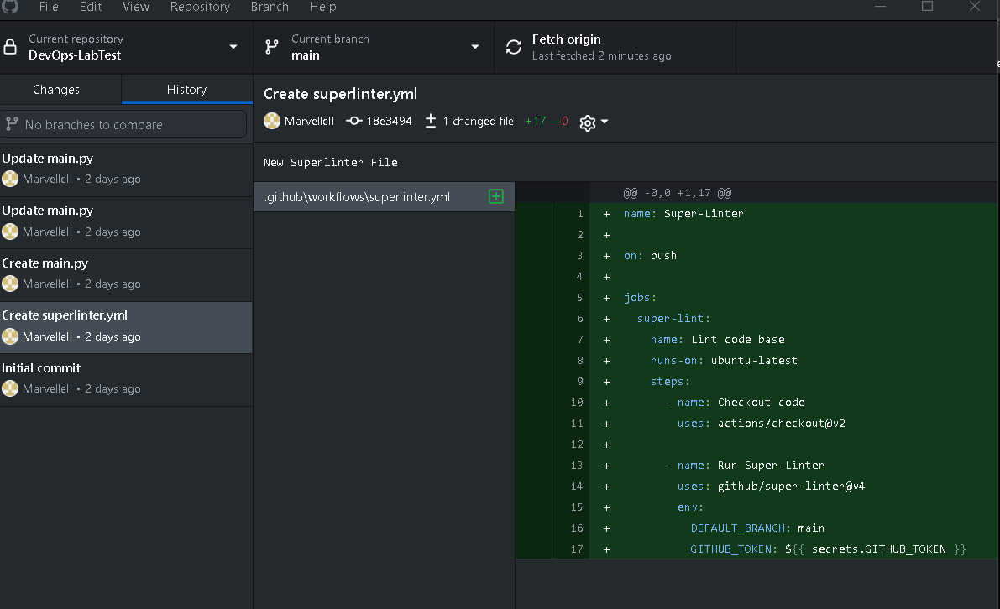
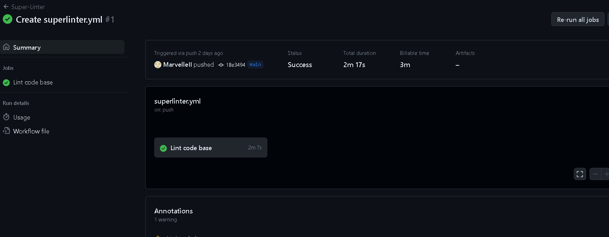
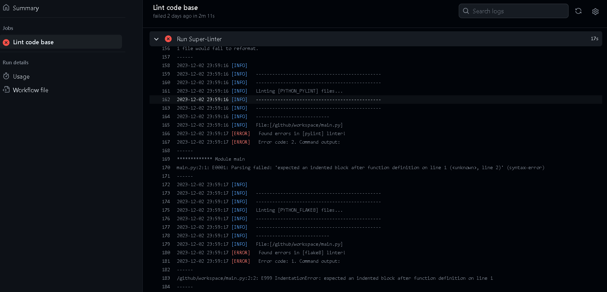
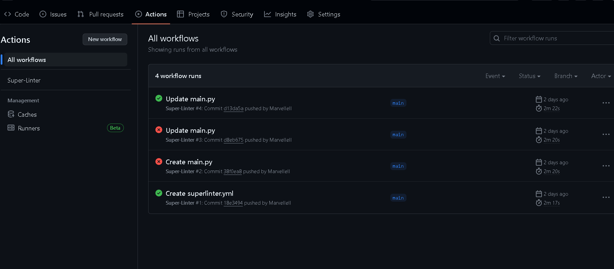

# CI/CD Lab: Introduction to GitHub Actions

## Lab Overview
Welcome to the CI/CD Lab! In this lab, you'll learn how to create a GitHub Actions workflow for continuous integration and deployment (CI/CD). By the end of this lab, you'll have a workflow that automatically builds and tests your code whenever changes push to the repository.

## Exploring DevOps: A Beginner's Guide to CI/CD Workflows

DevOps refers to a set of practices and cultural philosophies that aim to integrate software development (Dev) and IT operations (Ops) to enhance collaboration, automate processes, and improve the overall efficiency and quality of software delivery.
DevOps practices in SQA focus on breaking down traditional silos between development and testing teams, promoting continuous collaboration, and automating testing and deployment processes.
GitHub Actions is an automation and continuous integration/continuous deployment (CI/CD) service provided by GitHub.
It allows you to automate various tasks and workflows within your GitHub repositories.
A workflow is a configurable-automated process that can run one or more jobs.
With GitHub Actions, you can set up custom workflows that automatically run in response to specific events, such as code pushes, pull requests, or issue comments.
These workflows are defined in YAML files and can perform a wide range of tasks, including building and testing code, deploying applications, and automating various development processes.

## Objective

In this beginner tutorial, we will use Super Linter to explore key DevOps and CI/CD principles.
A Super Linter is a tool designed for linting (analyzing source code to identify potential issues, errors, or deviations from coding conventions without actually executing the code).
By integrating Super Linter into our CI/CD pipeline, we automate code quality checks, aligning with DevOps practices of automation and continuous integration.
This tool helps maintain code consistency, provides quick feedback on issues, and demonstrates the importance of quality in the development process.
Follow along to discover the basics of DevOps using Super Linter.

## Prerequisites
* A GitHub account
* A sample web application (e.g., a simple HTML and CSS website)
* Basic knowledge of Git and version control
* A GitHub repository containing your sample web application

## Lab Tasks

1. Create a new GitHub repository, for example "DevOps-LabTest"



2. In your GitHub repository, create a new file with the following directory structure:
`.github/workflows/superlinter.yml`

3. Next, copy and paste the following code into the file:
```
name: Super-Linter

on: push

jobs:
  super-lint:
    name: Lint code base
    runs-on: ubuntu-latest
    steps:
      - name: Checkout code
        uses: actions/checkout@v2

      - name: Run Super-Linter
        uses: github/super-linter@v4
        env:
          DEFAULT_BRANCH: main
          GITHUB_TOKEN: ${{ secrets.GITHUB_TOKEN }}
```

This GitHub Actions workflow is triggered on every push to the repository. It checks out the code and runs the Super-Linter on it, which is a tool for linting and validating various types of files in your repository, ensuring code quality and consistency. The workflow is configured to run on an Ubuntu environment using the latest available version.



NOTE: If your workflow is not triggering check to make sure your directory structure is named correctly.  

4. Commit and push the workflow file to your GitHub repository.

5. Go to the "Actions" tab in your GitHub repository to see your workflow in action.
Observe the CI/CD pipeline running automatically when you push changes to the repository.



6. Test your CI/CD pipeline by creating and pushing a python file that you know will generating some linting errors. 
- Create a new file in your repository and name it main.py.
- Copy and paste the following code into this file:
```
def hello():
print("hi")


def bye():
  print("bye")


print(hello())
```

This code contains syntax errors that should trigger the superlinter to fail. 

7. Observe the error notification that indicates the superlinter check has failed.



8. Next, click on the red X icon and select “Details”. 
Scroll down until you see the section displaying the code from the main.py file. 


9. In this code, the superlinter is recommending that you reformat the file by deleting any lines of code with a “-“ next to it, and adding in the lines of code with the “+” next to it.
Reformat the main.py to correct these syntax errors.
After updating the file, the superlinter will rerun and should display a green checkmark.
If you still are showing a red x, check the superlinter details again to see if there are any additional syntax errors remaining.



By completing this lab, you'll gain hands-on experience with setting up a CI/CD pipeline using GitHub Actions. 

## Reference Materials
- **Python**:
  * [Python Documentation](https://docs.python.org/3/)
- **CI/CD**:
  * [CID Documentation](https://resources.github.com/ci-cd/)
- **DevOps**:
  * [DevOps Documentation](https://www.dynatrace.com/news/blog/what-is-devops/?msclkid=a045c214e63a14df1048a749b77b57fd&msclkid=a045c214e63a14df1048a749b77b57fd&gclid=CJeHptOy1oIDFUuUAwgdWHICLA)
