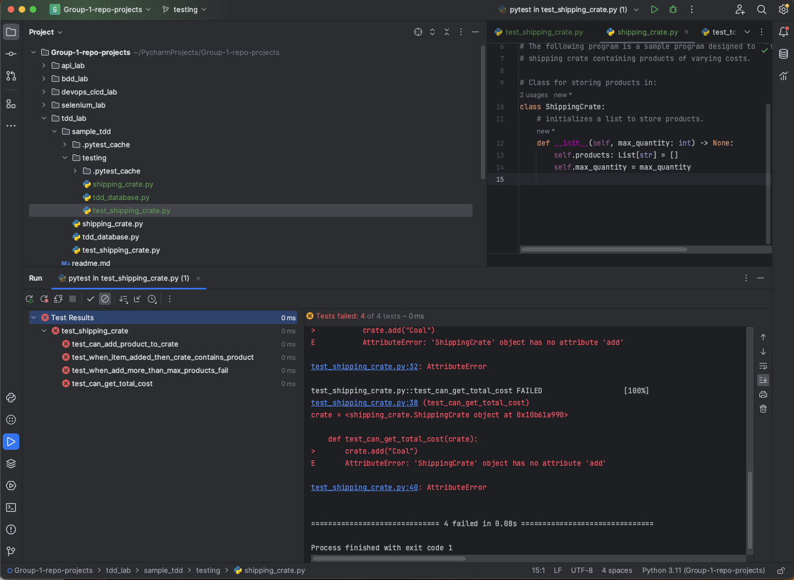
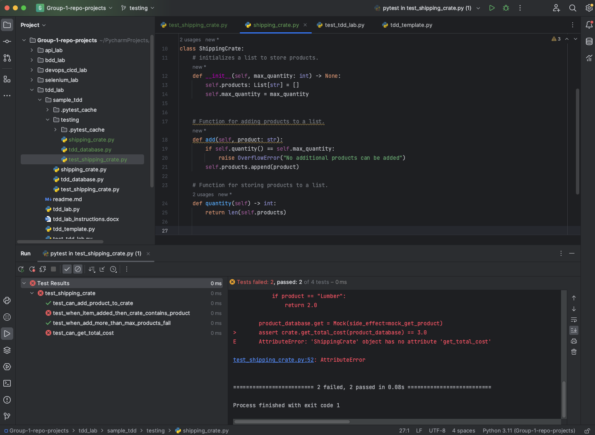
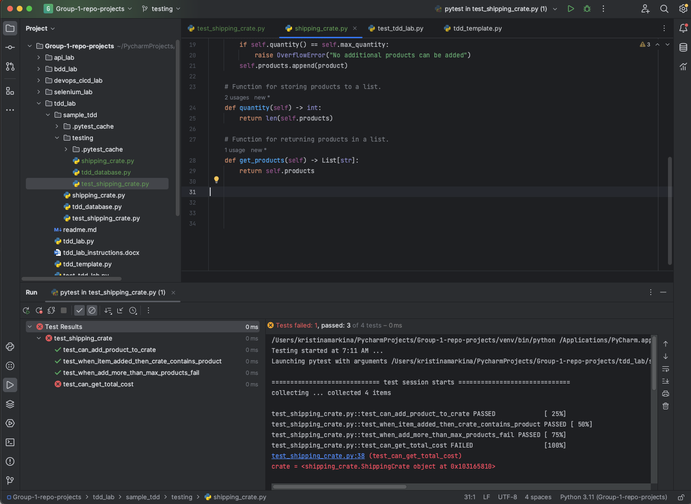
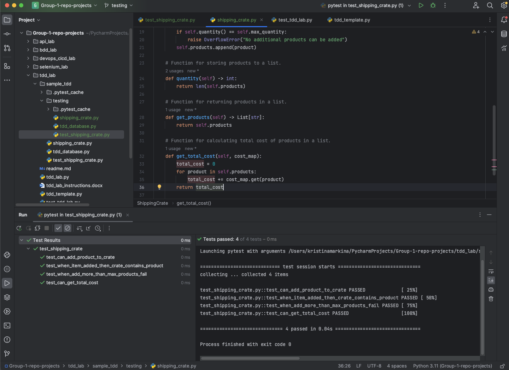
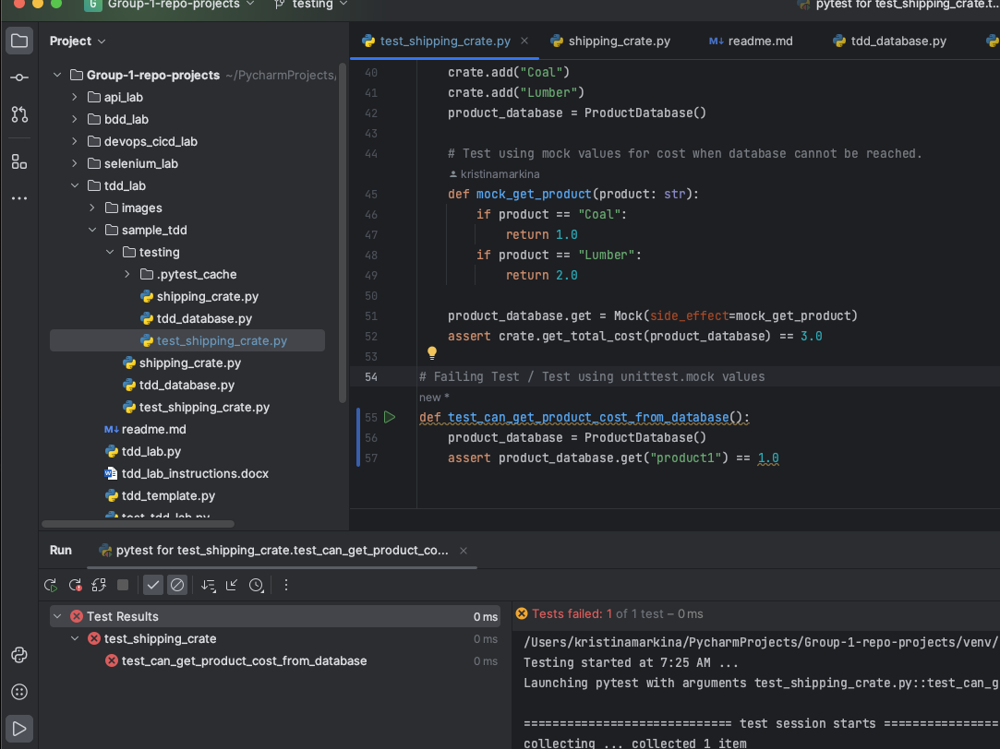
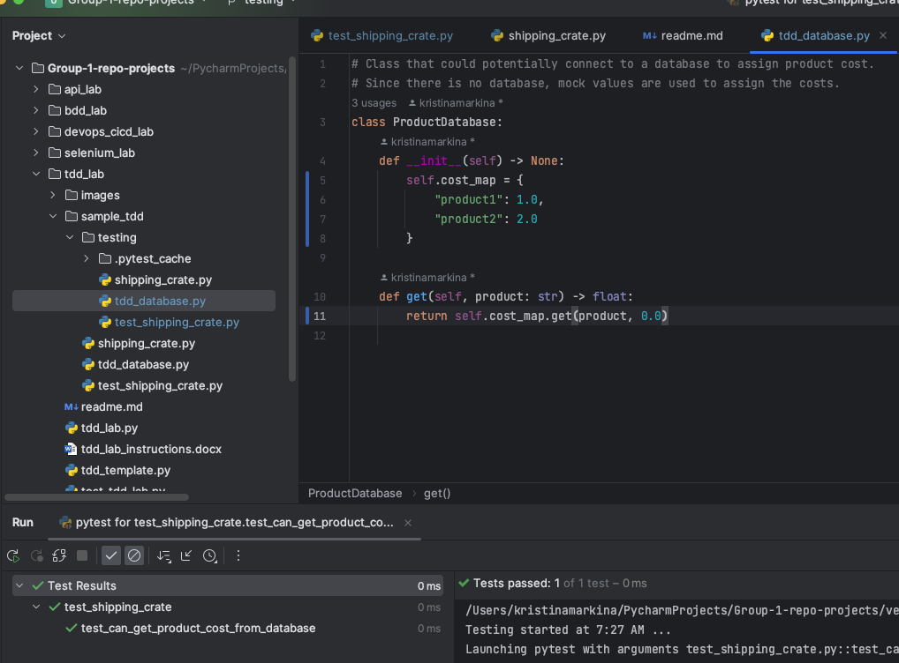

# TDD Lab: Introduction to Test-driven Development

## Lab Overview
Welcome to the TDD Lab!
In this lab, you will learn how to create more logical code by first testing.
Test-driven development focuses on breaking programs into compact, manageable, and scalable pieces by building functionality from failing tests.
By the end of this lab, you will know how to use the TDD methodology to aid in software problem-solving and planning processes.

## Lab Objectives

- Gain proficiency in using Python’s testing framework, Pytest.
- Understand how to write testable, well-designed code before production code.
- Learn how to use Pytest for test-driven development.
- Develop Mock unit tests for testing the necessary functionalities of a program.
- Understand test-driven development’s purpose and best practices.
- Recognize how to use the Typing library for TDD purposes.

## Lab Prerequisites

- Basic knowledge of Python programming.
- Understanding of how to install Python libraries using pip.
- Installation of Pytest (pip install pytest).
- Familiarity with the basics of Pytest and unit testing.

## Lab Features

The lab contains six Python files.
The sample_tdd folder contains an example program to guide you in creating a TDD program.
The files will serve as templates for your program with TDD best practices to guide you through.
You should have a simple, working program similar to the example provided by the end.

### Review the TDD example
Inside the sample_tdd folder is a sample program created using TDD, complete with individual files used for production code, test code, and mock tests.
Recall that the production code is responsible for a particular process, whereas the test code outlines the necessary functions that require implementation. In TDD, test code is written before production code, acting as a guiding hand in the design process. The production code serves to pass the tests by the simplest means.
Once you’ve finished reviewing the example program, open the tdd_lab and test_tdd_lab files. The files directly reflect the process used for creating the sample_tdd. Following through the files, you will practice the TDD cycle by creating failing tests and writing the minimum amount of code to make the tests pass. Lastly is the tdd_template file, where you will begin designing your program using step-by-step TDD processes. You may consider using the tdd_lab and test_tdd_lab files in developing/testing your program. 

### Begin designing a program under TDD 

You can reference the tdd_template file, tdd_lab, and test_tdd_lab files to use when developing. 
The recommended method would be to use the test_tdd_lab for writing tests and the tdd_template file for writing production code. 

### Reference the TDD example

If you need to, you can continually reference the TDD sample. The program you create will, of course, conventionally differ. But, you will similarly need to implement mock tests, Pytest fixtures, and the typing library when designing your program.
Locate additional resources at the end of this document. There is official Python documentation for mock unit tests, Pytest, Pytest fixtures, and the typing library. 

### Ensure your TDD program is complete

After you have completed your program, all the tests you’ve created should pass. 
Remember to check whether you have successfully implemented the necessary tests, code, and libraries/frameworks into your program.

## Lab Challenge

To solidify your understanding of Test-driven development, check that your program contains at least one instance of the following:

- Mock values used for testing.
- Pytest fixtures.
- Typing library assigned variable types.

Lastly, consider adding additional tests for functions not yet implemented or altering the existing tests to achieve different results. Although the base program is simple, you can expand or change the design to fulfill another purpose. 

## Expected Results

1. Create class ShippingCrate and initialize it. All 4 tests should fail.



2. Add the following methods to ShippingCrate class (add and quantity):

```python
# Function for adding products to a list.
    def add(self, product: str):
        if self.quantity() == self.max_quantity:
            raise OverflowError("No additional products can be added")
        self.products.append(product)

    # Function for storing products to a list.
    def quantity(self) -> int:
        return len(self.products)
```

3. Test again. Now this tests passed but getting products and getting total cost still fails.



4. Add get_product method

```python
    # Function for returning products in a list.
    def get_products(self) -> List[str]:
        return self.products
```

5. This fixed one test but not another:



6. Add get_total_cost method:

```python
    # Function for calculating total cost of products in a list.
    def get_total_cost(self, cost_map):
        total_cost = 0
        for product in self.products:
            total_cost += cost_map.get(product)
        return total_cost
```

7. All tests passed:



8. Add the following test to test_shipping_crate.py:

```python
def test_can_get_product_cost_from_database():
    product_database = ProductDatabase()
    assert product_database.get("product1") == 1.0
```

Run it. It should fail.



9. Now add following code to tdd_database.py:

```python
    def __init__(self) -> None:
        self.cost_map = {
            "product1": 1.0,
            "product2": 2.0
        }

    def get(self, product: str) -> float:
        return self.cost_map.get(product, 0.0)
```

Now you can get products from database:



### Lab Examples

The program you create following this lab will differ from the example program provided in this lab. However, you will end with a program that follows a similar structure.

Although you may consider not using a TDD framework for testing/development (It isn’t always the best approach). TDD has numerous applications, and you should know when TDD is appropriate. Consider implementing TDD when you continually add new functionalities to a program or need easy-to-extend software. You can reference this lab when following TDD cycles in creating programs.

### Lab Takeaway

Upon completing this lab, you should be confident in implementing test-driven development strategies. You will understand how to use Python’s Pytest and Unittest libraries under the TDD cycle. Your understanding of TDD practices applies to other programming languages and paradigms.

## Reference Materials
- **Python**:
  * [Python Documentation](https://docs.python.org/3/)
- **TDD**:
  * [TDD Documentation](https://agiledata.org/essays/tdd.html)
- **Pytest**:
  * [Pytest documentation](https://docs.pytest.org/en/7.4.x/)
  * [Pytest Howto](https://docs.pytest.org/en/7.1.x/how-to/fixtures.html)
- **Unittest**:
  * [Unittest documentation](https://docs.python.org/3/library/unittest.html)
  * [Unittest mock](https://docs.python.org/3/library/unittest.mock.html) 
- **Test-driven Development**:
  * [TDD](https://www.agilealliance.org/glossary/tdd/)
- **Typing Library**:
  * [Typing Library](https://docs.python.org/3/library/typing.html)
